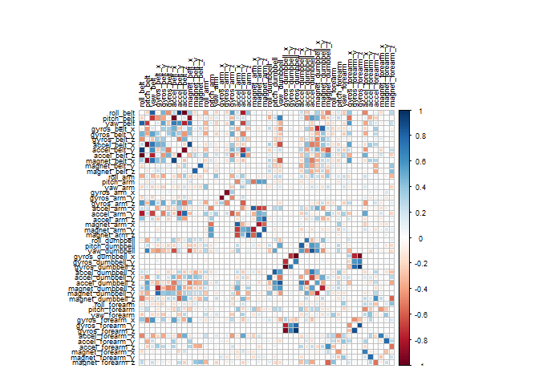
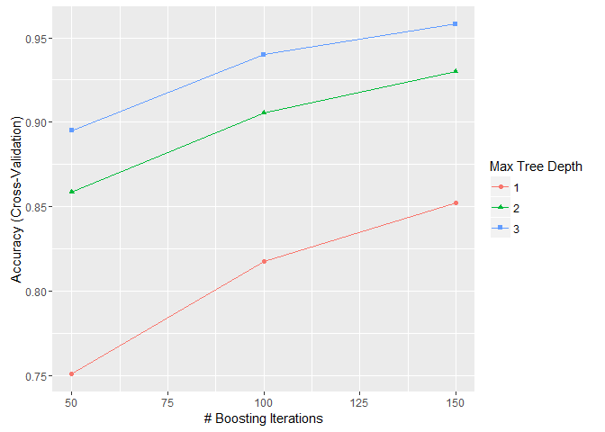
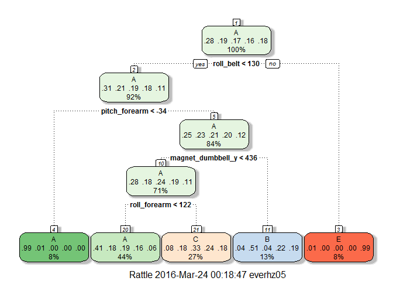

```r
require('knitr')
require('caret')
require('rpart')
require('rattle')
require('corrplot')
require('gbm')
```

###Background & Introduction
#####Using physical fitness trackers like Fitbit and Nike+ now make it possible to collect a large amount of data about personal activity. These type of devices are part of the quantified self movement; a group of enthusiasts who take measurements about themselves regularly to improve their health, to find patterns in their behavior, or because they are tech geeks. One thing that people regularly do is quantify how much of a particular activity they do, but they rarely quantify how well they do it. 

#####This project attempts to make predictions about the quality of how well an exercise might be performed based upon data and research obtained and conducted by Pontifical Catholic University of Rio de Janeiro department of Informatics and the School of Computing and Communication, Lancaster University in the UK.

#####In this project, we will use data derived from accelerometers on the belt, forearm, arm, and dumbell of 6 participants in the study (cited below). Those participants were asked to perform barbell lifts correctly and incorrectly in 5 different ways ('classe'). The five ways are exactly according to the specification: 

1. (Class A) corresponds to correct performance
2. (Class B) throwing the elbows to the front;
3. (Class C) lifting the dumbbell only halfway;
4. (Class D) lowering the dumbbell only halfway;
5. (Class E) and throwing the hips to the front;

#####The goal of this project is to predict the manner in which 20 (provided) test cases will occur, i.e., Class A to E. The prediction will occur using the final model fit that we believe will best predict on the provided test data set for twenty (20) users. 

#####More information regarding the original study is available from the website here: http://groupware.les.inf.puc-rio.br/har.


```r
if(!file.exists("pml-training.csv")){
   download.file(url="https://d396qusza40orc.cloudfront.net/predmachlearn/pml-training.csv",
              destfile="pml-training.csv")
}
if(!file.exists("pml-testing.csv")){
    download.file(url="https://d396qusza40orc.cloudfront.net/predmachlearn/pml-testing.csv",
              destfile="pml-testing.csv")
}
```

###Loading the data
#####The training set will be used and partitioned to create a training set and testing for cross validation of the model fits. The testing set file ('pml-testing.csv') provided in the course will be used exclusively for the final model fit and prediction.


```r
dat.train <- read.csv('pml-training.csv', na.strings = c('', 'NA'))
dat.quiz <- read.csv('pml-testing.csv', na.strings = c('', 'NA'))
```

#####Identify columns that have complete cases and only keep those with complete cases. The first six columns are not useful for our reproduction nor are the incomplete columns, which are primarily summary statistics.


```r
#Process the training test set
dat.train.1 <- dat.train[,colnames(dat.train)[complete.cases(t(dat.train))]] 
dat.train.2 <- dat.train.1[, 8:60] #remove useless variables (cols 1:7)
final.train <- dat.train.2[, 
    !grepl("^amplitude|^kurtosis|^skewness|^avg|^cvtd_timestamp|^max|^min
    |^new_window|^raw_timestamp|^stddev|^var|^user_name|X|^total"
    ,x=names(dat.train.2))]

#Process the quiz test set
dat.quiz <- dat.quiz[,colnames(dat.quiz)[complete.cases(t(dat.quiz))]] 
#ditch NA cols
dat.quiz.1 <- dat.quiz[, 8:60] #remove useless variables (cols 1:7)
final.quiz <- dat.quiz.1[, 
    !grepl("^amplitude|^kurtosis|^skewness|^avg|^cvtd_timestamp|^max|^min
    |^new_window|^raw_timestamp|^stddev|^var|^user_name|X|^total"
    ,x=names(dat.quiz.1))]

rm(dat.quiz, dat.train, dat.quiz.1, dat.train.1, dat.train.2)
```


```r
set.seed(3331) #set psuedo-randomization seed for reproducibility
inTrain <- createDataPartition(final.train$classe, p = .70, list = FALSE)
trainingSet <- final.train[inTrain, ]
testingSet <- final.train[-inTrain, ]
```


```r
m <- cor(trainingSet[,1:48])
corrplot(m, method = 'circle', title = 'Correlation Plot of Predictors', tl.col = 'black', tl.cex = .5)
```



###Model Selection 1 - Generalized Boosted Model ('gbm')
#####We picked a general boosted model as our first model fit attempt to predict the quality of how well a user might perfor the dumbbell exercise. We'll fine tune the control of this model fit by specifying cross validation sampling, with k-folds = 5 and repeated sampling (1).


```r
if (file.exists('gbmFit.Rds')) 
    {
      gbmFit <- readRDS('gbmFit.Rds')
} else {
  set.seed(3332) #set psuedo-randomization seed for reproducibility
  fitControl <- trainControl(method = 'cv', number = 5
                            , repeats = 1)
  fit.gbm <- train(classe ~ .
                   , data = trainingSet
                   , method = 'gbm'
                   , trControl = fitControl
                   , verbose = FALSE)
  saveRDS(fit.gbm, file = 'gbmFit.Rds')
} 
fit.gbm
```

```
## Stochastic Gradient Boosting 
## 
## 13737 samples
##    48 predictor
##     5 classes: 'A', 'B', 'C', 'D', 'E' 
## 
## No pre-processing
## Resampling: Cross-Validated (5 fold) 
## Summary of sample sizes: 10989, 10989, 10991, 10991, 10988 
## Resampling results across tuning parameters:
## 
##   interaction.depth  n.trees  Accuracy   Kappa      Accuracy SD
##   1                   50      0.7487797  0.6814692  0.012553881
##   1                  100      0.8193195  0.7713589  0.004578193
##   1                  150      0.8528800  0.8138425  0.005165753
##   2                   50      0.8559378  0.8175413  0.005629516
##   2                  100      0.9082040  0.8838205  0.004860416
##   2                  150      0.9314987  0.9133216  0.001664394
##   3                   50      0.8943730  0.8662982  0.002149120
##   3                  100      0.9405981  0.9248392  0.002387848
##   3                  150      0.9605443  0.9500782  0.001762625
##   Kappa SD   
##   0.015880824
##   0.005746434
##   0.006650737
##   0.007165414
##   0.006142718
##   0.002086873
##   0.002735215
##   0.003038023
##   0.002236623
## 
## Tuning parameter 'shrinkage' was held constant at a value of 0.1
## 
## Tuning parameter 'n.minobsinnode' was held constant at a value of 10
## Accuracy was used to select the optimal model using  the largest value.
## The final values used for the model were n.trees = 150,
##  interaction.depth = 3, shrinkage = 0.1 and n.minobsinnode = 10.
```

```r
ggplot(fit.gbm)
```



###Cross Validation and Accuracy of Model One
#####We noted solid accuracy in the training model fit as well as accuracy in the cross-validation of the testing dataset at ~ 96%, with an out of sample error rating < 5%. The confusion matrix shows a relatively low mis-classification rate on the predictions. In general, the misclassifications appeared to be around 1%.


```r
set.seed(3333)
pred.gbm <- predict(fit.gbm, testingSet)
cm.gbm <- confusionMatrix(testingSet$classe, pred.gbm)
cm.gbm$table;cm.gbm$overall[1]
```

```
##           Reference
## Prediction    A    B    C    D    E
##          A 1650   14    5    2    3
##          B   33 1081   20    4    1
##          C    0   27  985   12    2
##          D    1    1   28  930    4
##          E    2   18    6   20 1036
```

```
##  Accuracy 
## 0.9655055
```

###Model Selection 2 - RPart
#####The gbm performed extremely well and we'll attempt to fit another model using a classification tree an cross  validation as a comparison. In this approach we'll be using k = 5 folds (or nodes) of classification and prediction. What becomes apparent in the fancy plot is that it appears poor form in the belt_roll predictor either leads directly to a failed performance measure or to throw the forearm predictor off.


```r
set.seed(3334)
fitControl.2 <- trainControl(method = 'cv', number = 3, repeats = 1)
fit.rpart <- train(classe ~ ., data = trainingSet
                   , method = "rpart", trControl = fitControl.2)
fancyRpartPlot(fit.rpart$finalModel)
```



####Cross validation and accuracy of model 2
#####The rpart model doesn't perform as well with only ~ 49% accuracy or out of sample error rate exceeding 51%. Therefore, we wil use model #1 for the final exam.


```r
set.seed(3335)
pred.rp <- predict(fit.rpart, testingSet)
cm.rp <- confusionMatrix(testingSet$classe, pred.rp)
cm.rp$table;cm.rp$overall[1]
```

```
##           Reference
## Prediction    A    B    C    D    E
##          A 1529   26  116    0    3
##          B  465  380  294    0    0
##          C  461   28  537    0    0
##          D  442  181  341    0    0
##          E  144  148  294    0  496
```

```
## Accuracy 
## 0.499915
```


```r
#log.dat <- log(abs(new.dat[,1:47])+1) #accounting for -Inf obs by adding 1
#pca.log <- prcomp(log.dat, center = TRUE, scale = TRUE)
#log.dat$classe <- new.dat[,48]
#pca.log$classe <- new.dat[,48]
#plot(pca.log, type = 'l') #Plot of PC variance
```
###Predicting on the Test Set with the Final Model Fit
#####When we run the gbm fit and prediction methods on the testing data we get a 96% accuracy rating for prediction on the testing set. The final output represents the 20 predicted testing results for Quiz #4.


```r
set.seed(3336)
final.fit <- predict(fit.gbm, newdata = final.quiz)
cm.final <- confusionMatrix(testingSet$classe, predict(fit.gbm, testingSet))
final.fit
```

```
##  [1] B A B A A E D B A A B C B A E E A B B B
## Levels: A B C D E
```

```r
cm.final$table;cm.final$overall[1]
```

```
##           Reference
## Prediction    A    B    C    D    E
##          A 1650   14    5    2    3
##          B   33 1081   20    4    1
##          C    0   27  985   12    2
##          D    1    1   28  930    4
##          E    2   18    6   20 1036
```

```
##  Accuracy 
## 0.9655055
```
