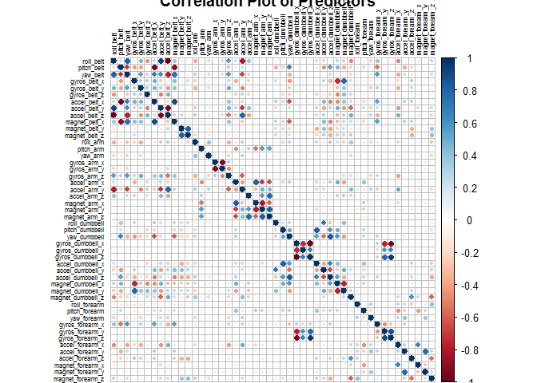

```r
require('knitr')
require('caret')
require('rpart')
require('rattle')
require('corrplot')
require('gbm')
```

```r
if(!file.exists("pml-training.csv")){
   download.file(url="https://d396qusza40orc.cloudfront.net/predmachlearn/pml-training.csv",
              destfile="pml-training.csv")
}
if(!file.exists("pml-testing.csv")){
    download.file(url="https://d396qusza40orc.cloudfront.net/predmachlearn/pml-testing.csv",
              destfile="pml-testing.csv")
}
```

###Background & Introduction
#####Using physical fitness trackers like Fitbit and Nike+ now make it 
possible to collect a large amount of data about personal activity. These 
type of devices are part of the quantified self movement – a group of 
enthusiasts who take measurements about themselves regularly to improve their 
health, to find patterns in their behavior, or because they are tech geeks. 
One thing that people regularly do is quantify how much of a particular 
activity they do, but they rarely quantify how well they do it.

This project attempts to make predictions about the quality of how well an 
exercise might be performed based upon data and research obtained and 
conducted by Pontifical Catholic University of Rio de Janeiro department of 
Informatics and the School of Computing and Communication, Lancaster 
University in the UK.

In this project, we will be to use data from accelerometers on the belt, 
forearm, arm, and dumbell of 6 participant Those participants were asked to 
perform barbell lifts correctly and incorrectly in 5 different ways 
('classe'). The five ways are exactly according to the specification (Class 
A), throwing the elbows to the front (Class B), lifting the dumbbell only 
halfway (Class C), lowering the dumbbell only halfway (Class D) and throwing 
the hips to the front (Class E). Only Class A corresponds to correct 
performance. The goal of this project is to predict the manner in which they 
did the exercise, i.e., Class A to E. More information is available from the 
website here: http://groupware.les.inf.puc-rio.br/har. We are using the whole 
dataset as opposed to the pre-determined training and testing sets provided 
in the course.

####Loading the data
#####We read in the data file accounting for NA-strings and remove columns of 
data that aren't useful for performing any of the analyses we are interested 
in; namely, columns 1-7 are identifying, time series or window variables that 
won't provide use for feature selection in building the model.

```r
dat.test <- read.csv('pml-testing.csv', na.strings = c('', 'NA'))
dat.train <- read.csv('pml-training.csv', na.strings = c('', 'NA'))
```

#####Identify columns that have complete cases and only keep those with 
complete cases. The first six columns are not useful for our reproduction nor are the incomplete columns, which are primarily summary statistics.


```r
dat.test.1 <- dat.test[,colnames(dat.test)[complete.cases(t(dat.test))]] 
#ditch NA cols
dat.test.1.1 <- dat.test.1[, 8:60] #remove useless variables (cols 1:7)
new.test <- dat.test.1.1[, 
    !grepl("^amplitude|^kurtosis|^skewness|^avg|^cvtd_timestamp|^max|^min
    |^new_window|^raw_timestamp|^stddev|^var|^user_name|X|^total"
    ,x=names(dat.test.1.1))]
dat.train.1 <- dat.train[,colnames(dat.train)[complete.cases(t(dat.train))]] 
#ditch NA cols
dat.train.1.1 <- dat.train.1[, 8:60] #remove useless variables (cols 1:7)
new.train <- dat.train.1.1[, 
    !grepl("^amplitude|^kurtosis|^skewness|^avg|^cvtd_timestamp|^max|^min
    |^new_window|^raw_timestamp|^stddev|^var|^user_name|X|^total"
    ,x=names(dat.train.1.1))]
rm(dat.test, dat.train, dat.test.1, dat.train.1, dat.test.1.1, dat.train.1.1)
```


```r
set.seed(3331) #set psuedo-randomization seed for reproducibility
inTrain <- createDataPartition(new.train$classe, p = .70, list = FALSE)
training <- new.train[inTrain, ]
testing <- new.train[-inTrain, ]
m <- cor(training[,1:48])
corrplot(m, method = 'circle')
```


####Model Selection 1 - Generalized Boosted Model
#####We picked a general boosted model as our first model fit attempt to 
predict the quality of how well a user might perfor the dumbbell exercise.


```r
if (file.exists('gbmFit1.Rds')) 
    {
      gbmFit1 <- readRDS('gbmFit1.Rds')
} else {
  set.seed(3332) #set psuedo-randomization seed for reproducibility
  fitControl <- trainControl(method = 'cv', number = 3
                            , repeats = 1)
  gbmFit1 <- train(classe ~ .
                   , data = training
                   , method = 'gbm'
                   , trControl = fitControl
                   , verbose = FALSE)
  } 
gbmFit1
```

```
## Stochastic Gradient Boosting 
## 
## 13737 samples
##    48 predictor
##     5 classes: 'A', 'B', 'C', 'D', 'E' 
## 
## No pre-processing
## Resampling: Cross-Validated (3 fold) 
## Summary of sample sizes: 9158, 9158, 9158 
## Resampling results across tuning parameters:
## 
##   interaction.depth  n.trees  Accuracy   Kappa      Accuracy SD
##   1                   50      0.7508190  0.6838301  0.007593509
##   1                  100      0.8175002  0.7690349  0.001981606
##   1                  150      0.8522967  0.8131342  0.006232043
##   2                   50      0.8588484  0.8212302  0.007257373
##   2                  100      0.9056563  0.8806184  0.007100139
##   2                  150      0.9298246  0.9112071  0.006767688
##   3                   50      0.8949552  0.8670349  0.004212121
##   3                  100      0.9399432  0.9240055  0.007396241
##   3                  150      0.9581422  0.9470399  0.006193660
##   Kappa SD   
##   0.009340729
##   0.002447725
##   0.007848679
##   0.009120324
##   0.008961040
##   0.008582996
##   0.005318817
##   0.009383818
##   0.007857363
## 
## Tuning parameter 'shrinkage' was held constant at a value of 0.1
## 
## Tuning parameter 'n.minobsinnode' was held constant at a value of 10
## Accuracy was used to select the optimal model using  the largest value.
## The final values used for the model were n.trees = 150,
##  interaction.depth = 3, shrinkage = 0.1 and n.minobsinnode = 10.
```

```r
g <- ggplot(gbmFit1)
g
```


####Cross Validation and Accuracy of Model One
#####We noted significant accuracy in the training model fit as well as 
significant accuracy in the cross-validation of the testing dataset at ~ 96%, which leaves what appears to be an extremely low out of sample error rating < 5%. The confusion matrix shows a relatively low mis-classification rate on 
the predictions. In general, the misclassifications appeared to be around 1%.


```r
pred.gbm <- predict(gbmFit1, testing)
cm.gbm <- confusionMatrix(testing$classe, pred.gbm)
cm.gbm$table;cm.gbm$overall[1]
```

```
##           Reference
## Prediction    A    B    C    D    E
##          A 1649   12    6    4    3
##          B   33 1077   26    2    1
##          C    0   26  988   10    2
##          D    1    0   35  927    1
##          E    3   17    4   21 1037
```

```
##  Accuracy 
## 0.9648258
```

####Model Selection 2 - RPart
#####The gbm performed extremely well and we'll attempt to fit another model 
using a classification tree an cross  validation as a comparison. In this 
approach we'll be using k = 5  folders (or nodes) of classification and 
prediction. What becomes aparenet in the fancy plot is that it appears poor form in the belt_roll predictor either leads directly to a failed performance measure or to throw the forearm predictor off.


```r
fitControl.2 <- trainControl(method = 'cv', number = 5)
fit.rpart <- train(classe ~ ., data = training, method = "rpart", trControl = fitControl.2)
f <- fancyRpartPlot(fit.rpart$finalModel)
```


```r
f
```

```
## NULL
```

####Cross validation and accuracy of model 2
#####The rpart model doesn't perform as well with only ~ 49% accuracy or out 
of sample error rate exceeding 51%. Therefore, we wil use model #1 for the final exam.


```r
pred.rp <- predict(fit.rpart, testing)
cm.rp <- confusionMatrix(testing$classe, pred.rp)
cm.rp$table;cm.rp$overall[1]
```

```
##           Reference
## Prediction    A    B    C    D    E
##          A 1529   26  116    0    3
##          B  465  380  294    0    0
##          C  461   28  537    0    0
##          D  442  181  341    0    0
##          E  144  148  294    0  496
```

```
## Accuracy 
## 0.499915
```


```r
#log.dat <- log(abs(new.dat[,1:47])+1) #accounting for -Inf obs by adding 1
#pca.log <- prcomp(log.dat, center = TRUE, scale = TRUE)
#log.dat$classe <- new.dat[,48]
#pca.log$classe <- new.dat[,48]
#plot(pca.log, type = 'l') #Plot of PC variance
```
###Predicting on the Test Set with the Final Model Fit
#####When we run the gbm fit and prediction methods on the testing data we get a 96% accuracy rating for prediction on the testing set. The final output represents the 20 predicted testing results for Quiz #4.


```r
final.fit <- predict(gbmFit1, newdata = new.test)
confusionMatrix(testing$classe, predict(gbmFit1, testing))
```

```
## Confusion Matrix and Statistics
## 
##           Reference
## Prediction    A    B    C    D    E
##          A 1649   12    6    4    3
##          B   33 1077   26    2    1
##          C    0   26  988   10    2
##          D    1    0   35  927    1
##          E    3   17    4   21 1037
## 
## Overall Statistics
##                                           
##                Accuracy : 0.9648          
##                  95% CI : (0.9598, 0.9694)
##     No Information Rate : 0.2865          
##     P-Value [Acc > NIR] : < 2.2e-16       
##                                           
##                   Kappa : 0.9555          
##  Mcnemar's Test P-Value : 2.037e-10       
## 
## Statistics by Class:
## 
##                      Class: A Class: B Class: C Class: D Class: E
## Sensitivity            0.9781   0.9514   0.9330   0.9616   0.9933
## Specificity            0.9940   0.9870   0.9921   0.9925   0.9907
## Pos Pred Value         0.9851   0.9456   0.9630   0.9616   0.9584
## Neg Pred Value         0.9912   0.9884   0.9854   0.9925   0.9985
## Prevalence             0.2865   0.1924   0.1799   0.1638   0.1774
## Detection Rate         0.2802   0.1830   0.1679   0.1575   0.1762
## Detection Prevalence   0.2845   0.1935   0.1743   0.1638   0.1839
## Balanced Accuracy      0.9861   0.9692   0.9625   0.9770   0.9920
```

```r
final.fit
```

```
##  [1] B A B A A E D B A A B C B A E E A B B B
## Levels: A B C D E
```
